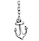
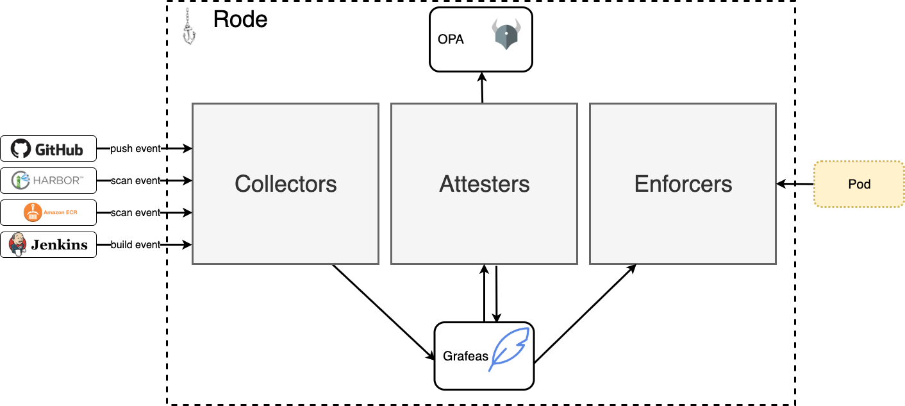
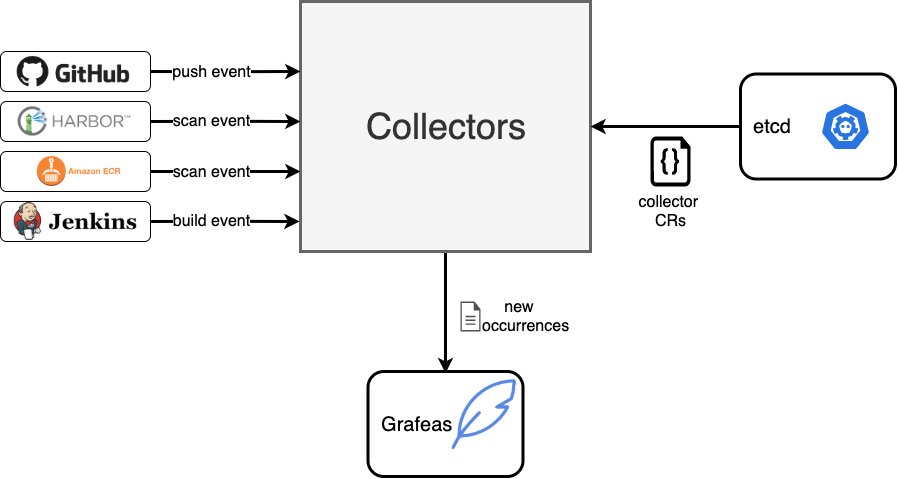
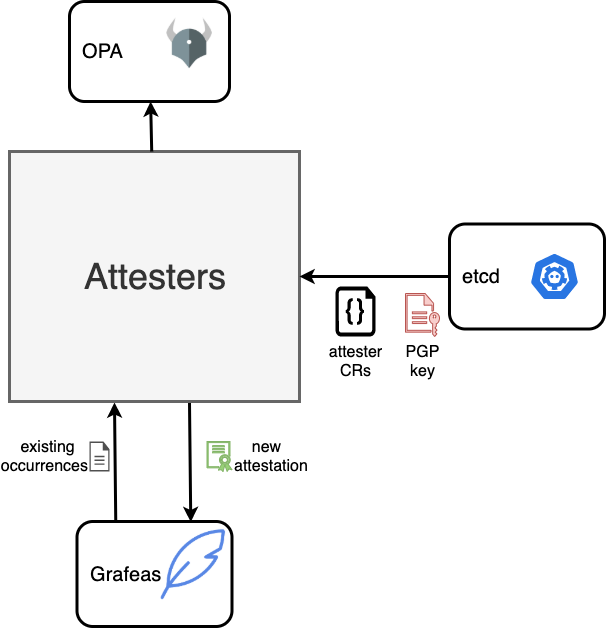
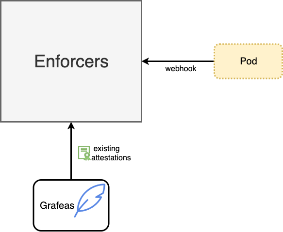

#  Rode 

> \rōd\ - a line (as of rope or chain) used to attach an anchor to a boat

Rode provides the collection, attestation and enforcement of policies in your software supply chain.



There are 3 primary components in rode: `collectors`, `attesters` and `enforcers`

## Collectors
Collectors are responsible for receiving events from external systems and converting them into [occurrences](https://github.com/grafeas/grafeas/blob/master/docs/grafeas_concepts.md#occurrences) in [Grafeas](https://github.com/grafeas/grafeas).



The list of supported collectors is growing and currently includes:
* **ECR Events** - image scan events are sent to an SQS queue via CloudWatch event rules.  A collector in rode processes the messages from the queue and converts them into [discovery](https://github.com/grafeas/grafeas/blob/master/docs/grafeas_concepts.md#kind-specific-schemas) and [vulnerability](https://github.com/grafeas/grafeas/blob/master/docs/grafeas_concepts.md#kind-specific-schemas) occurrences in Grafeas.

Collectors are defined as `Collector` [custom resources](https://kubernetes.io/docs/concepts/extend-kubernetes/api-extension/custom-resources/).  See below for an example:

```
apiVersion: rode.liatr.io/v1alpha1
kind: Collector
spec:
  name: my_collector
  type: ecr_event
  queueName: my_ecr_event_queue
```

## Attesters
Attesters monitor collectors for new `occurrences`.  Whenever a new occurrence is created on a [resource](https://github.com/grafeas/grafeas/blob/master/docs/grafeas_concepts.md#resource-urls), then all occurrences are loaded for that resource and passed in to [Open Policy Agent (OPA)](https://www.openpolicyagent.org/) to determine if all necessary occurrences exist for the resource.

If all occurrences exist and comply with the policy, then the attester will use its private PGP key to sign a new attestation for the resource and store the attestation in Grafeas.



Attesters are defined as `Attester` [custom resources](https://kubernetes.io/docs/concepts/extend-kubernetes/api-extension/custom-resources/).  See below for an example:

```
apiVersion: rode.liatr.io/v1alpha1
kind: Attester
spec:
  name: my_collector
  pgp-secret: my_secret_name
  policy: |
    package my_collector

    violation[{"msg":"analysis failed"}]{
        input.occurrences[_].discovered.discovered.analysisStatus != "FINISHED_SUCCESS"
    }
    violation[{"msg":"analysis not performed"}]{
        analysisStatus := [s | s := input.occurrences[_].discovered.discovered.analysisStatus]
        count(analysisStatus) = 0
    }
    violation[{"msg":"critical vulnerability found"}]{
        severityCount("CRITICAL") > 0
    }
    violation[{"msg":"high vulnerability found"}]{
        severityCount("HIGH") > 10
    }
    severityCount(severity) = cnt {
        cnt := count([v | v := input.occurrences[_].vulnerability.severity; v == severity])
    }
```

The PGP key is automatically generated and stored as a Kubernetes secret if it doesn't already exist.

## Enforcers
Enforcers are defined as [validating admission webhook](https://kubernetes.io/docs/reference/access-authn-authz/extensible-admission-controllers/) that ensures the resource defined as an `image` in the `Pod` has been properly attested.

Enforcers are configured to ensure the specified attester referenced in the namespace for the pod had successfully created an attestation. The namespace must include a label for enforcement to be activated:


```
  "rode.liatr.io/enforce": true
```



# Installation
The easiest way to install rode is via the helm chart:

```
helm repo add liatrio https://harbor.toolchain.lead.prod.liatr.io/chartrepo/public
helm upgrade -i rode liatrio/rode
```

Setup collectors, attesters and enforcers through a quickstart:

`kubectl apply -f examples/aws-quickstart.yaml`

The ECR event collector requires the following IAM policy.  Either attach the policy to the EC2 instance or use IRSA and pass the role ARN to Helm:

```
helm upgrade -i rode liatrio/rode --set rbac.serviceAccountAnnotations."eks\.amazonaws\.com/role-arn"=arn:aws:iam::1234567890:role/RodeServiceAccount
```

```
{
    "Version": "2012-10-17",
    "Statement": [
        {
            "Effect": "Allow",
            "Action": [
                "sqs:CreateQueue"
                "sqs:SetQueueAttributes",
                "sqs:GetQueueUrl",
                "sqs:GetQueueAttributes",
                "sqs:ReceiveMessage",
                "sqs:DeleteMessage",
            ],
            "Resource": "*"
        },
        {
            "Effect": "Allow",
            "Action": [
                "events:PutTargets",
                "events:PutRule"
            ],
            "Resource": "*"
        }
    ]
}
```
# Development
To run locally, install CRDs, then use skaffold with the `local` profile:

To install CRDs (Only needs to be run once):
`make install`

To run controllers:
`skaffold dev --port-forward`

This will also run [localstack](https://github.com/localstack/localstack) to mock services such as SQS.

Setup collectors, attesters and enforcers:
`kubectl apply -f examples/aws-quickstart.yaml`

To create an occurence, use the aws cli to send a test message to localstack:

```
aws sqs send-message \
    --endpoint-url http://localhost:30576 \
    --queue-url http://localhost:30576/queue/rode-ecr-event-collector  \
    --message-body file://test/sample_scan_event.json 
``` 
